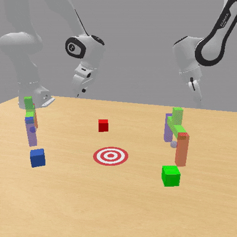
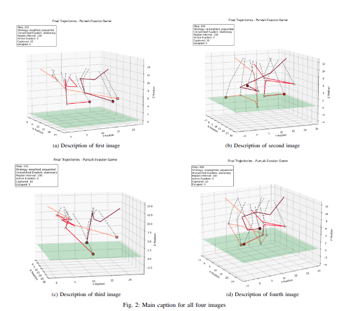

# Publications

## 2026

    

        
    

    

        <h3 class="publication-title">
            <a href="https://jstmn.github.io/colosseum-v2-website/" class="publication-link">
                Colosseum V2: Benchmarking Generalization for Vision Language Action Models
            </a>
        </h3>
        
In Submission

        
Jeremy Morgan, **Prajwal Vijay**, Hyeonho Oh, Jincen Song, Ashvin Arora, Alina Du, Gaurav Sukhatme, Jesse Thomason, Ishika Singh

        
2026

        

            Robot Learning Benchmark
            <a href="https://arxiv.org/abs/2605.27759" class="tag tag-arxiv">ARXIV</a>
            <a href="https://github.com/jstmn/ColosseumV2" class="tag tag-github">GITHUB</a>
        

    

    

        
    

    

        <h3 class="publication-title">
            <a href="" class="publication-link">
                Geometric Coherence via Weighted Matching for 3D Heterogeneous Multi-Agent Reach-Avoid Games
            </a>
        </h3>
        
MARS Workshop@ICRA2026

        
**Prajwal Vijay**

        
2026

        

            Multi-Agent Robotic Systems
            <a href="" class="tag tag-arxiv">
            PREPRINT COMING SOON!</a>
            <a href="https://github.com/Prajwal-Vijay/geometric-coherence-weighted-matching" class="tag tag-github">GITHUB</a>
        

    

